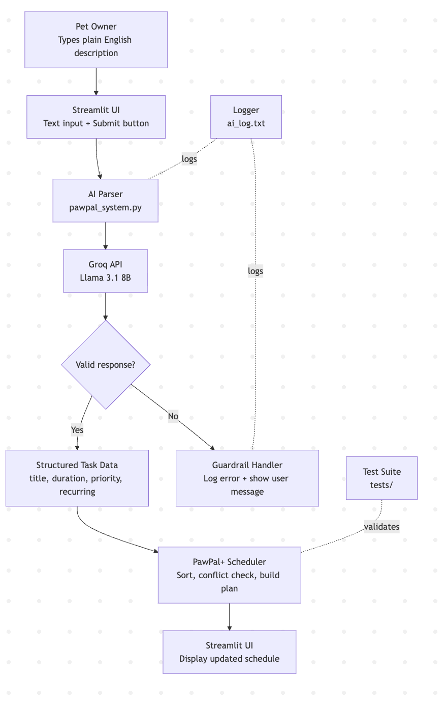

# PawPal+ AI Scheduling Assistant

PawPal+ helps pet owners plan their day. You describe what your pet needs in plain English, and the AI turns it into a scheduled task list automatically.

---

## Original Project

This builds on **PawPal+**, a Streamlit app where users manually added pet care tasks and got a daily schedule. It handled priority sorting, recurring tasks, and conflict detection. The goal was to help busy pet owners stay consistent with their routines.

---

## What's New

Instead of filling out a form, you just type something like:

> "My dog needs a 30-minute walk and his pill every morning"

The AI reads it, creates the tasks, and adds them to your schedule.

---

## System Diagram



**How data flows:**
1. You type a description in the app
2. The AI (Groq / Llama 3.1) extracts task details from it
3. The app checks the response is valid before using it
4. Tasks get added to your schedule
5. Everything is logged in `ai_log.txt`

---

## Setup

**1. Clone the repo**
```bash
git clone https://github.com/sergiobenab29/applied-ai-system-project.git
cd applied-ai-system-project
```

**2. Create a virtual environment**
```bash
python -m venv .venv
source .venv/bin/activate
```

**3. Install dependencies**
```bash
pip install -r requirements.txt
```

**4. Get a free Groq API key**
- Go to [console.groq.com](https://console.groq.com)
- Sign up and click **API Keys** → **Create API key**

**5. Add your key**
```bash
export GROQ_API_KEY="your-key-here"
```

**6. Run the app**
```bash
streamlit run app.py
```

---

## Sample Interactions

---

## Design Decisions


---

## Testing


---

## Reflection
